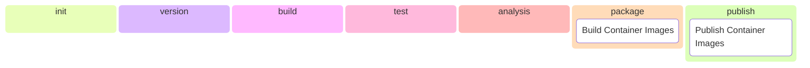

# ZeroFailed.Build.Containers

[](https://github.com/zerofailed/ZeroFailed.Build.Containers/actions/workflows/build.yml)
[](https://github.com/zerofailed/ZeroFailed.Build.Containers/releases)
[](https://www.powershellgallery.com/packages/ZeroFailed.Build.Containers)
[](https://github.com/zerofailed/ZeroFailed.Build.Containers/blob/main/LICENSE)

A [ZeroFailed](https://github.com/zerofailed/ZeroFailed) extension providing container image build and publish capabilities.

## Overview

| Component Type | Included | Notes                                                                                                                                                         |
| -------------- | -------- | ------------------------------------------------------------------------------------------------------------------------------------------------------------- |
| Tasks          | yes      |                                                                                                                                                               |
| Functions      | yes      |                                                                                                                                                               |
| Processes      | no       | Designed to be compatible with the default process provided by the [ZeroFailed.Build.Common](https://github.com/zerofailed/ZeroFailed.Build.Common) extension |

For more information about the different component types, please refer to the [ZeroFailed documentation](https://github.com/zerofailed/ZeroFailed/blob/main/README.md#extensions).

This extension consists of the following feature groups, refer to the [HELP page](./HELP.md) for more details.

- Building container images
- Publishing container images

The diagram below shows the discrete features and when they run as part of the default build process provided by [ZeroFailed.Build.Common](https://github.com/zerofailed/ZeroFailed.Build.Common).



## Pre-Requisites

Functionality within this extension may require the following components to be installed:

- [Docker CLI]()
- [Azure CLI]()

## Dependencies

The following ZeroFailed extensions will be installed when using this extension.

| Extension                                                                        | Reference Type | Version |
| -------------------------------------------------------------------------------- | -------------- | ------- |
| [ZeroFailed.Build.Common](https://github.com/zerofailed/ZeroFailed.Build.Common) | git            | `main`  |

## Getting Started

If you are starting something new and don't yet have a ZeroFailed process setup, then follow the steps here to bootstrap your new project.

Once you have the above setup (or it you already have that), then simply add the following to your list of required extensions (e.g. in `config.ps1`):

```powershell
$zerofailedExtensions = @(
    ...
    # References the extension from its GitHub repository. If not already installed, use latest version from 'main' will be downloaded.
    @{
        Name = "ZeroFailed.Build.Containers"
        GitRepository = "https://github.com/zerofailed/ZeroFailed.Build.Containers"
        GitRef = "main"     # replace this with a Git Tag or SHA reference if want to pin to a specific version
    }

    # Alternatively, reference the extension from the PowerShell Gallery.
    @{
        Name = "ZeroFailed.Build.Containers"
        Version = ""   # if no version is specified, the latest stable release will be used
    }
)
```

To use the extension to build a container image from an existing `Dockerfile`, simply add the `ContainersToBuild` property to your build configuration file, as shown below.

```powershell
# Load the tasks and process
. ZeroFailed.tasks -ZfPath $here/.zf

...

$ContainersToBuild = @(
    @{
        Dockerfile = "src/Dockerfile"
        ImageName = "my-container-image"
        # ContextDir = "<path-to-docker-build-context-dir>"  # Optional
        # Target = "<build-stage-name>"                      # Optional
        Arguments = @{                                       # Optional
            arg1 = "foo"
            arg2 = { $someDynamicValue }                     # Supports scriptblocks for deferred evaluation
        }
    }
)
# If publishing images to a container registry, provide its details
$ContainerRegistryType = "docker"       # Supports 'docker' or 'acr'
$DockerRegistryUsername = "myuser"      # Required when publishing to a docker registry

...

# Customise the build process
task . FullBuild
```

The [HELP page](./HELP.md) include details of all available configuration properties.

## Usage

For an end-to-end example of using this extension to build container images, please take a look at [this sample repo](https://github.com/zerofailed/ZeroFailed.Sample.Containers).

